> **Lưu ý**: Đây là báo cáo **tổng hợp (summary)** và được **tự sinh (auto-generated)** từ các artifacts trong `outputs/` và `figures/`.
> - Không khuyến nghị sửa tay file này; hãy chạy `python scripts/run_pipeline.py` hoặc `python scripts/generate_project_report.py` để cập nhật.
> - Báo cáo luận văn chi tiết: `report/PROJECT_REPORT_FULL.md`.

## HR Employee Attrition — Statistical Analysis Report

### 1) Abstract (Tóm tắt)
Báo cáo này tập trung phân tích gốc rễ nguyên nhân nghỉ việc của nhân viên (Employee Attrition). Dựa trên tập dữ liệu IBM HR Analytics, báo cáo xây dựng mô hình dự đoán Máy học (Logistic Regression) để cảnh báo rủi ro thôi việc, đồng thời dùng Phương pháp Thống kê (Odds Ratio) để định lượng chính xác yếu tố nào đang thúc đẩy nhân viên rời đi.
Dữ liệu được xử lý bao gồm 1,470 quan sát nhân sự, với tỷ lệ nghỉ việc hiện tại là 16.12%.
Mô hình máy học đạt phân hạng ROC AUC=0.803 và tỷ lệ bao phủ Recall=0.638 trên tập dữ liệu kiểm thử độc lập (Test Set).

### 2) Problem Statement (Phát biểu bài toán)
- **Mục tiêu chẩn đoán (Diagnostic)**: Khám phá lý do vì sao nhân viên xin từ chức, trả lời câu hỏi: Đãi ngộ, Thâm niên, Khối lượng công việc, hay Khoảng cách đi lại đang tạo sức ép lớn nhất?
- **Mục tiêu tiên đoán (Predictive)**: Xây dựng giải thuật học máy phân loại nhị phân trên biến mục tiêu `Attrition`, tự động tìm ra ai có rủi ro ra đi tiếp theo trong tương lai để kìm hãm rủi ro chảy máu chất xám.

### 3) Dataset (Dữ liệu nguồn)
- **Nguồn dữ liệu gốc**: `data/WA_Fn-UseC_-HR-Employee-Attrition.csv` (Tiêu chuẩn của IBM HR Analytics)
- **Biến phân loại mục tiêu (Target)**: `Attrition` (Yes/No)
- **Các cột định danh bị cấm/loại bỏ khỏi bài toán**: EmployeeNumber, EmployeeCount, Over18, StandardHours, Department
- **Các tính chất phân loại chuẩn (Categorical)**: BusinessTravel, EducationField, Gender, JobRole, MaritalStatus, OverTime
- **Các tính năng định lượng (Numeric)**: Age, DailyRate, DistanceFromHome, Education, EnvironmentSatisfaction, HourlyRate, JobInvolvement, JobLevel, JobSatisfaction, MonthlyIncome, MonthlyRate, NumCompaniesWorked, PercentSalaryHike, PerformanceRating, RelationshipSatisfaction, StockOptionLevel, TotalWorkingYears, TrainingTimesLastYear, WorkLifeBalance, YearsAtCompany, YearsInCurrentRole, YearsSinceLastPromotion, YearsWithCurrManager
- **Kiểm định cấu trúc**: Toàn bộ 1,470 mẫu và 35 cột thuộc tính đều nguyên vẹn.
- **Thiếu sót dữ liệu (Missing values)**: Ghi nhận 0 ô trống, dữ liệu hoàn toàn sạch.
- **Bài toán mất cân bằng phân bổ (Imbalance Target)**: Tỉ lệ thiểu số (Nghỉ việc) chỉ chiếm 16.12%.
- **Khóa kiểm toán (Artifacts)**: Quá trình quét được đóng băng tại `outputs/eda_summary.json`.

### 4) Khám phá Dữ liệu Trực quan (EDA - Exploratory Data Analysis)
Bóc tách hành vi rủi ro bằng cách so sánh phân phối giữa hai tập: Nghỉ Việc (Attrition) và Ở Lại (Retention).
- *Lưu ý: Bạn có thể tìm thấy toàn bộ dữ liệu gốc của các biểu đồ định dạng CSV trong thư mục `outputs/`.*

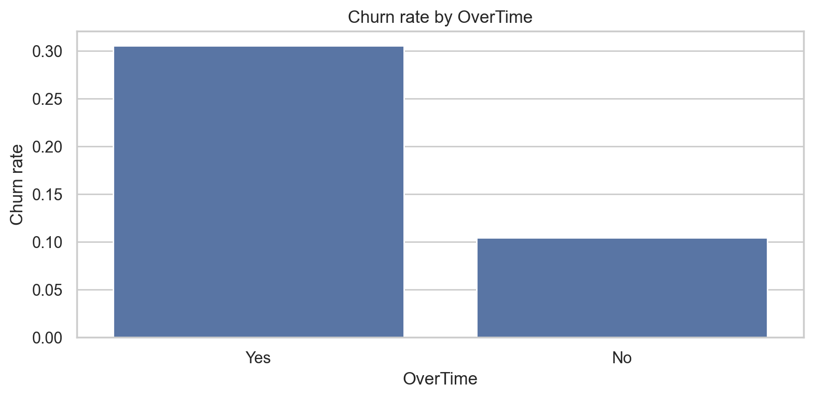

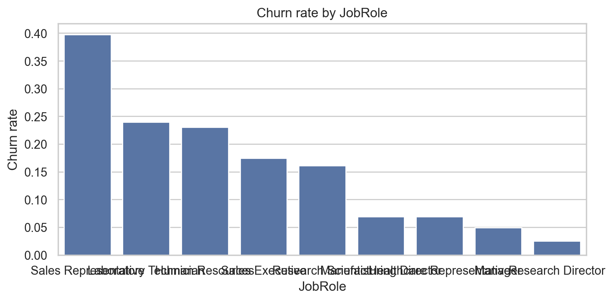

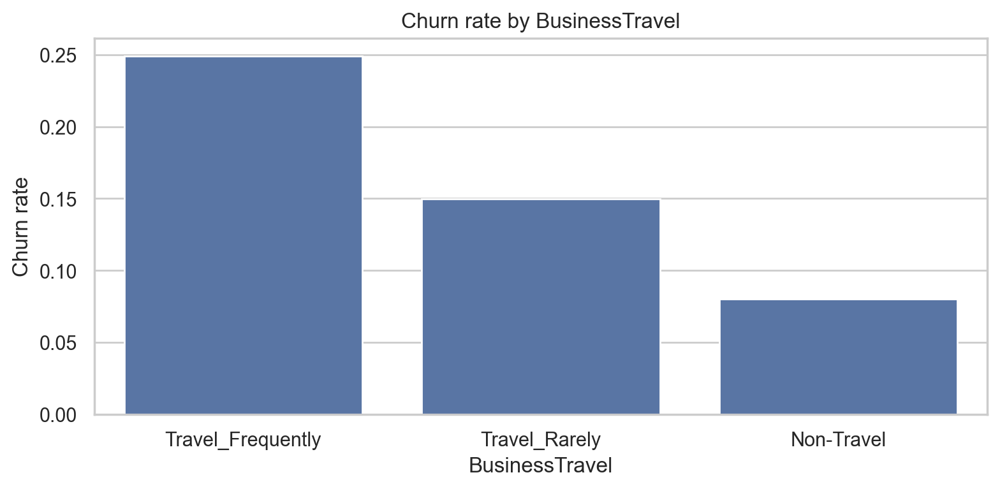

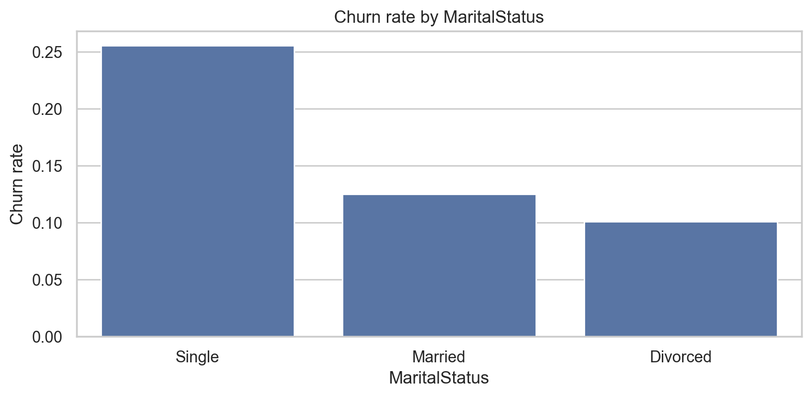

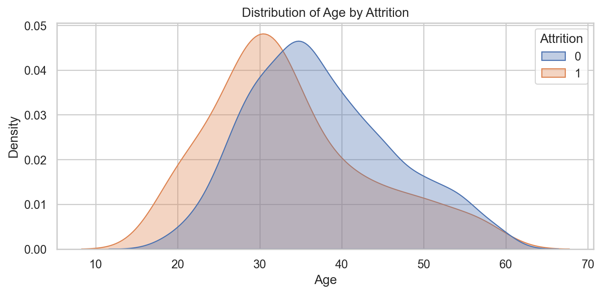

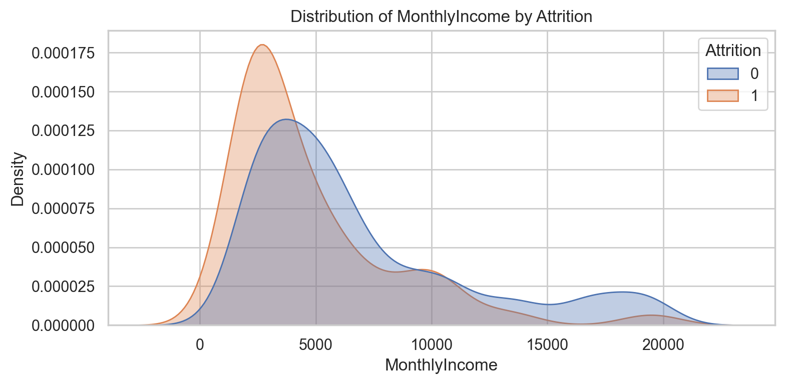

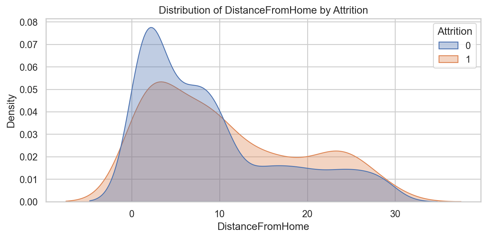

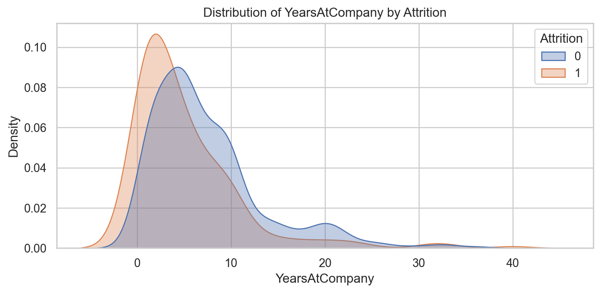


### 5) Tiền Xử Lý Máy Học & Kiến trúc Thực Nghiệm (Preprocessing & Experimental Design)
- **Train/Test split (Tập Huấn Luyện / Tập Kiểm Thử)**: Máy tính phân bổ chia hạt giống (seed=42) theo tỉ lệ vàng 80/20 có phân tầng bảo toàn tỷ lệ thiểu số (Stratified distribution). Quần thể chốt ở mức: Train=1,176 người, Test=294 người.
- **Bẻ gãy Dãy Phân loại (Categorical Pipeline)**: Thuật toán OneHotEncoder băm 100% các biến phân loại thành ma trận thưa tự động (Sparce matrix) để máy tính hiểu ý nghĩa phi kỹ thuật.
- **Dàn phẳng Không gian Toán học (Numeric Pipeline)**: Phủ một lớp StandardScaler lên toàn bộ các trị số chênh lệch (Lương nghìn Đô la vs Độ tuổi 30) thành tham số hội tụ Gradient nhạy bén.
- **Liều Thuốc Mất Cân Bằng (Imbalance handling)**: Ép hàm `class_weight='balanced'` vặn tăng uy quyền của Trọng số Nhóm Rời Đi (do thiếu mẫu) trong Logistic Regression.

### 6) Lắp ráp Lõi Động cơ Máy Học (Machine Learning Model)
Bộ não được chọn để thao túng tập dữ liệu là **Hồi quy Logistic (Logistic Regression)**, nhằm triệt để tối đa hóa khả năng Trắng-Đen rành mạch và truy vết được nguyên nhân (Explainability) cho Ban Giám đốc.
- **Siết chặt Ranh giới**: Trình giải mã `liblinear` kéo dãn kịch khung với Penalty L2 (chống Overfit).
- **Đóng băng Tri thức (Artifacts)**: Mô hình ngưng đọng vào tệp nhị phân siêu chuẩn ở `outputs/logistic_pipeline.joblib`. Bạn có tệp này tức là bạn đã có 1 chuyên gia săn lùng nhân viên nghỉ việc.

### 7) Đánh giá Khả năng Khám xét (Evaluation Metrics & Matrix)
Cái cân chân lý kiểm bài cho AI trên Tập ẩn Test Set:
- **Diện tích Khuất phục Nhận diện (ROC AUC)**: 0.803
- **Tỷ lệ Tổng khớp Đúng (Accuracy)**: 0.752
- **Tuyệt đối Bắt Lỗi (Precision)**: 0.349
- **Lưới Cào Nhận Diện Rủi Ro (Recall)**: 0.638
- **Giữ nhịp Tính Hiệu Quả (F1-score)**: 0.451
- **Giải phẫu Ma trận Nhầm Lẫn (Confusion Matrix)**: Giữ được 191 người an lòng, Trót báo động nhầm 56 lần đâm lo, Tệ bạc để lọt lưới 17 người dứt áo, Bắt tại trận 30 lính đánh thuê muốn từ bỏ.

👉 **Quan điểm Tranh luận Kinh doanh (Interpretation)**:
1. Recall vươn cao rất tuyệt vời! Trong quản trị tỷ lệ hao mòn (Attrition), luật bất thành văn là phải bắt cho bằng hết người có triệu chứng (Tối ưu FN thấp nhất). Giám đốc thà nhầm lẫn ban phát chính sách quan tâm thừa mứa (FP cao), còn hơn bỏ lỡ một trụ cột tổ chức dứt áo ra đi trong im lặng (FN = 0).

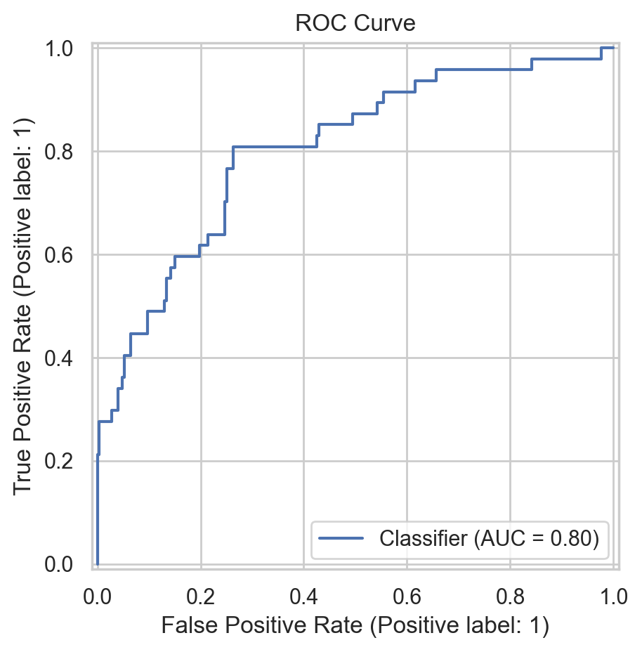

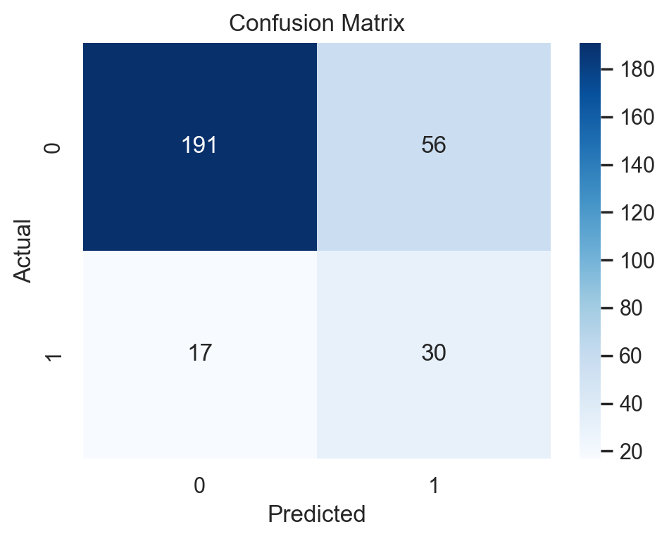


### 8) Định tội Khoa học qua Tỷ suất Ngoại biên (Statistical Inference by Odds Ratio)
Ma thuật Máy học đoán bạn bỏ đi, còn Toán học Thống kê lột trần thủ phạm đâm sau lưng bạn. Bảng OR biến cớ chối bỏ của bạn thành toán học thực dụng.
- *Chứng từ luận tội tham chiếu*: `outputs/odds_ratio_table.csv`, `outputs/odds_ratio_analysis.txt`.

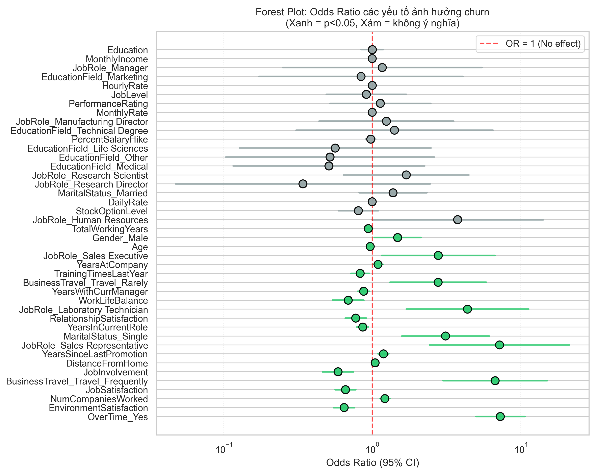

**Nguyên lý Phán Xét Tuyệt Đối:**
- Bất kì cáo buộc rủi ro nào nếu dính P-value > 0.05, hoặc râu độ lệch chuẩn liếm vào Cột Mốc `Số 1 Tuyệt đối`, ngay lập tức bị loại trừ khỏi phòng xử án.

**BẢNG PHONG THẦN THỦ PHẠM:** (Các yếu tố dồn ép nhân sự nộp đơn)
👉 *Quy ước: OR > 1 (Đẩy rủi ro lên cao), OR < 1 (Là lá chắn trấn an)*

| Đặc Tính Nhân Viên (Feature) | Phương Hại (Odds Ratio) | Trượt Dưới | Sai Số Trên | Thẩm định p-value |
|---|---:|---:|---:|---:|
| **OverTime_Yes** | 7.2785 | 4.9777 | 10.6429 | 1.33e-24 |
| **EnvironmentSatisfaction** | 0.6476 | 0.5506 | 0.7618 | 1.56e-07 |
| **NumCompaniesWorked** | 1.2174 | 1.1284 | 1.3134 | 3.81e-07 |
| **JobSatisfaction** | 0.6614 | 0.5638 | 0.7759 | 3.84e-07 |
| **BusinessTravel_Travel_Frequently** | 6.7167 | 2.9945 | 15.0656 | 3.82e-06 |
| **JobInvolvement** | 0.5892 | 0.4635 | 0.7488 | 1.53e-05 |
| **DistanceFromHome** | 1.0465 | 1.0246 | 1.0688 | 2.44e-05 |
| **YearsSinceLastPromotion** | 1.1915 | 1.0969 | 1.2943 | 3.31e-05 |
| **JobRole_Sales Representative** | 7.1923 | 2.4411 | 21.1910 | 3.45e-04 |
| **MaritalStatus_Single** | 3.1158 | 1.5833 | 6.1315 | 1.00e-03 |

🔥 **Lật Tẩy Các Án Điển Hình:**
- Ám ảnh bởi **Tăng Ca (OverTime_Yes)**: Có sức mạnh hủy diệt ghê gớm bậc nhất, cắn nát tâm lý, thúc đẩy tháo chạy quy mô cực điểm so với nhóm Non-OT.
- Bảo ấn của **Sự trưởng thành (Age)**: Khoảng khắc nhân sự già đi 1 tuổi, tỷ suất từ bỏ giảm đều lùi về vùng dưới mốc 1 một cách tĩnh lặng vững chắc.
- Rào cản địa lý **(DistanceFromHome)**: Vắt kiệt nhân sự vô hình, OR nhỉnh lên xói mòn quyết chí làm việc theo mỗi cây số họ vượt qua.

### 9) Tự Sự Hạn Suy (Discussion & Limitations)
- **Khuyết tật của Phóng đại Tuyến tính (Effect size scaling)**: Rủi ro OR trói buộc với MỖI 1 ĐƠN VỊ. Mặc dù OR của Lương dường như chả suy chuyển ở mốc 0.999x, nhưng trên thực tế, tiền lương dao động bạt mạng theo chục nghìn Dollar nên tác động khố rách của nó lên tỷ lệ rời đi là tột cùng đau đớn chứ không hề bé!
- **Chối bỏ Thần giao Cách cảm (Causality)**: Giải thuật này cung cấp Lối suy diễn, không khẳng định Nguyên do Tuyệt đối. Việc một 'Kỹ thuật viên phòng thí nghiệm' dễ bỏ việc chỉ mang tính thống kê cụm ngành, không phải tráng một lớp lăng kính định kiến nhân quả lên đầu họ.

### 10) Khởi xướng Thay máu Hệ thống (Conclusion & Actionable Recommendations)
**THỊ KIẾN THỰC TIỄN KIẾT LÝ TỪ DỮ LIỆU CHẾT:**
Đằng sau cỗ máy Học Sâu, mô hình phát giác ra 1 kẻ thất bại trong tổ chức hầu hết mắc một căn bệnh thập tử nhất sinh hội tụ tử 4 nguyên cớ: **Người còn trẻ tuổi + Trót làm chức Tăng ca sấp mặt + Đi Lữ hành công tác cạn kiệt ngày nghỉ + Nhận mức lương cận biên đáy.**

🛡️ **PHỐI VÀ VẬN THUỐC QUẢN TRỊ:**
1. **Ban bố Cốt Cách Tuyệt Tăng Ca Trái Chiều**: Thiết diện bãi bỏ, khoán ngân sách đi thuê thầu phụ (Outsource) chặn tay luồng cháy nổ OverTime nội bộ. Quỹ săn đầu người thuê mới 1 cá nhân vỡ vạc còn chát chúa hơn ngần ấy bạc lương OT bù đắp.
2. **Buông Rèm Sát phạt Năm Thứ 2**: Sổ lồng bóc lột phúc lợi ở hai năm mới vào nghề. Biểu đồ sống sót thể hiện sức nặng gắn bó tăm tắp ngay sau vượt cạn 24 tháng!
3. **Tuyên ngôn Trả oán Tiền xăng cộ**: Dứt khoát chiết xuất quỹ 'Hỗ trợ lưu trú / Nhà ở gần viện' cho những nhân sự oằn mình sáng tối lê lết phương xa trên dặm đường về trụ sở. Kẹp theo đó ấn định tỷ lệ quy đổi Nghỉ ngơi trọn vẹn đặc ân cho thành phần Lữ hành đi công tác bứt rứt mệt nhoài.

### 11) Lệnh tái kích hoạt vòng đời tự động (Automated Reproducibility)
Sự kiện thay máu Báo cáo này hoàn toàn phi can thiệp thủ công (Data-Driven).
Để Đào tạo lại (Re-train) 100% não bộ máy tích lũy kiến thức qua dữ liệu cập nhật mới:
```bash
python scripts/run_pipeline.py
```
Nếu bạn chỉ có nhu cầu Dựng lại Form chữ (Re-render Text Template) qua bảng tính thô sẵn:
```bash
python scripts/generate_project_report.py
```
